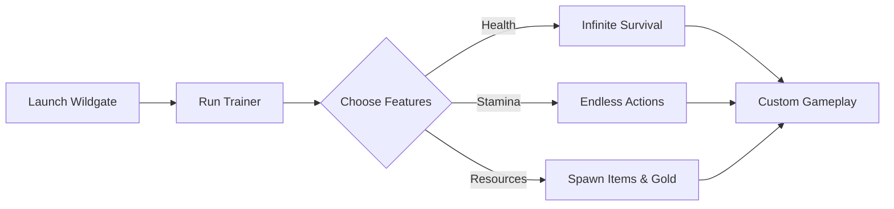

# Wildgate Trainer Tool ⚡ for Survival Control & Custom Gameplay

The fantasy world of *Wildgate* pushes players with unforgiving dungeons, PvP ambushes, and endless resource management. The **Wildgate Trainer** gives you complete flexibility over survival systems—allowing infinite stamina, adjustable health, and resource spawning. Whether you’re stress-testing builds, practicing duels, or exploring without limits, this tool puts the power in your hands.

[](#)
[](#)
[](#)
[](#)

---

## 🧭 Overview

Unlike cheat overlays, the trainer focuses on **core character and resource control**. This makes it the perfect companion for experimenting with builds, practicing risky encounters, or designing your own challenge runs. From god mode toggles to instant supply spawns, the trainer adapts to any playstyle.

---

## ⭐ Features

* **Infinite Health & Stamina** – Stay alive and agile in any fight.
* **Custom Resource Spawner** – Generate gold, potions, or rare crafting materials.
* **Damage Scaling** – Adjust enemy or player damage for testing.
* **Class Buffs** – Apply trainer effects to all builds instantly.
* **Hotkey Controls** – Toggle features quickly with customizable keys.

[!NOTE]
The trainer is for **single-player or private sessions only**—not recommended for public servers.

---

## 🖥 Compatibility

| Platform      | Status            | Notes                      |
| ------------- | ----------------- | -------------------------- |
| Windows 10/11 | ✅ Fully Supported | Stable trainer build       |
| Steam Deck    | ⚠️ Partial        | Proton setup may be needed |
| Consoles      | ❌ Not Supported   | PC-only tool               |

---

## ⚡ Setup Guide

1. Download the Wildgate Trainer package.
2. Extract the files into a secure folder.
3. Run with administrator rights:

   ```bash
   WildgateTrainer.exe --start
   ```
4. Configure your `trainer_config.json`:

   ```json
   {
     "god_mode": true,
     "infinite_stamina": true,
     "resources": ["Health Potion", "Mana Crystal", "Gold Bag"]
   }
   ```
5. Launch *Wildgate* and toggle features in real time using **F1–F8 hotkeys**.

---

## 🌀 Trainer Workflow Diagram



---

## ❓ FAQ

**Q: Can I disable features mid-run?**
A: Yes, all trainer functions toggle instantly.

**Q: Will this corrupt my saves?**
A: No, it runs externally and doesn’t modify save files.

**Q: Does it work with every class?**
A: Yes, buffs apply universally to all builds.

**Q: Can I share my configs?**
A: Absolutely—JSON configs are portable and easy to swap.

**Q: How often is it updated?**
A: Updates follow Wildgate’s patch schedule.

---

## 🚀 Final Thoughts

The **Wildgate Trainer Tool** is designed for players who want freedom and flexibility. From infinite stamina to resource spawning, it lets you tailor dungeon runs, PvP training, or sandbox exploration exactly how you want.

---
